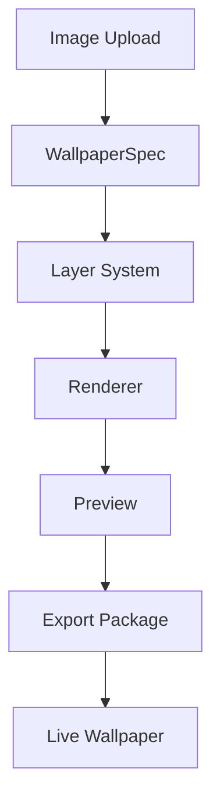
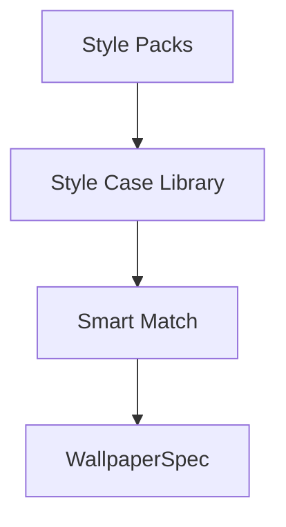

# AI Wallpaper Engine

Turn any image into a beautiful live wallpaper in minutes.

Upload your favorite image, apply beautiful animation effects, preview instantly and export your own live wallpaper.

上传你喜欢的图片，添加动态效果、镜头动画、图层和风格案例，快速制作属于自己的动态壁纸。

Not Photoshop. Not After Effects. No code required.

不是 Photoshop。不是 After Effects。也不需要写代码。

---

## Vision

Most live wallpaper editors are difficult to use.

Our goal is simple:

Turn any image into a beautiful live wallpaper without learning professional animation software.

Users shouldn't need Photoshop or After Effects just to make an image come alive.

大多数动态壁纸编辑器都太复杂。

AI Wallpaper Engine 的目标很简单：

让任何人都能把一张图片变成漂亮的动态壁纸，而不需要学习专业动画软件。

---

## Features

| Feature | Status |
| --- | --- |
| Image Upload | Done |
| Wallpaper Preview | Done |
| Layer System | Done |
| Camera Animation | Done |
| Dynamic Effect Library | Done |
| Quick Effect Controls | Done |
| Style Case Library | Done |
| Style Pack System | Foundation |
| Smart Match | Mock |
| Animation Provider Framework | Done |
| LivePortrait Integration Adapter | Experimental |
| Local Runtime Job Pipeline | Mock |
| LivePortrait Local Runtime MVP | Config / Health Check |
| Wallpaper Package Export | Done |
| Dark / Light Theme | Done |
| Responsive Studio UI | Done |

---

## Screenshots

### Studio Editor

> Coming Soon

### Smart Match

> Coming Soon

### Style Case Library

> Coming Soon

### Preview Mode

> Coming Soon

### Export Package

> Coming Soon

---

## Architecture





Core flow:

- Image Upload -> WallpaperSpec -> Layer System -> Renderer
- Renderer -> Preview / Export Package
- Style Packs -> Style Case Library -> Smart Match -> WallpaperSpec
- Animation Providers -> Motion Layers -> future model-driven animation
- Runtime Jobs -> Local Runtime Bridge -> Provider Output

核心流程：

- 图片上传 -> WallpaperSpec -> 图层系统 -> 渲染器
- 渲染器 -> 预览 / 导出网页壁纸包
- 风格包 -> 风格案例库 -> 智能匹配 -> WallpaperSpec
- 动画提供方 -> 运动图层 -> 未来模型驱动动画
- 运行时任务 -> 本地 Runtime Bridge -> Provider 输出

### Provider-first Architecture

V0.6 Sprint 18 adds the LivePortrait Integration Adapter.

LivePortrait is treated as an experimental `portrait-motion` provider, not as frontend code bundled into the editor.

Provider-first Architecture means external animation systems connect through stable adapters:

- Mock Provider for editor workflow
- LivePortrait Adapter for future portrait motion
- Future local CLI / local service / Docker runtimes

This keeps Python, PyTorch, GPU dependencies and model weights outside the React app.

V0.6 Sprint 18 新增 LivePortrait Integration Adapter。

LivePortrait 被视为实验性的 `portrait-motion` Provider，而不是直接写进前端的模型代码。

Provider-first Architecture 让外部动画能力通过稳定适配器接入，避免把 Python、PyTorch、GPU 依赖和模型权重放进 React 应用。

### Local Runtime Job Pipeline

V0.6 Sprint 19 adds a generic Local Runtime Job Pipeline.

Providers such as LivePortrait, Depth Anything and SAM2 can create runtime jobs without embedding Python or model weights in the frontend.

Current status:

- In-memory RuntimeJob manager
- Mock local runtime bridge
- LivePortrait fallback records `runtimeJobId`, `runtimeStatus`, `runtimeMode` and `fallback`
- MotionPanel shows Queued, Running, Completed, Failed and Fallback states

V0.6 Sprint 19 新增通用本地 Runtime Job Pipeline。

LivePortrait、Depth Anything、SAM2 等 Provider 未来可以通过统一任务机制接入，而不需要把 Python 或模型权重写进前端。

### LivePortrait Local Runtime MVP

V0.6 Sprint 20 adds local runtime configuration for LivePortrait.

The editor can now store runtime settings, show health check results, list missing requirements and build a command preview.

It still does not clone, install, download weights or execute Python automatically.

V0.6 Sprint 20 新增 LivePortrait 本地 Runtime 配置能力。

编辑器可以保存运行时路径、Python 命令、入口文件和输出目录，显示健康检查结果，并生成命令预览。

项目仍然不会自动 clone、安装依赖、下载权重或执行 Python。

---

## Style Pack System

Style Packs are reusable collections of `StyleCase` data.

Style Pack 是一组可复用的 `StyleCase` 数据集合。

| Pack Type | Description |
| --- | --- |
| Official Style Pack | Built-in curated styles maintained by the project. |
| Community Style Pack | User-created JSON style packs. |
| Future Marketplace | A future place to discover and share style packs. |

Safety model:

- Style Packs are pure JSON data.
- No external JavaScript is executed.
- Safe to import.

安全模型：

- Style Pack 只包含 JSON 数据。
- 不执行任何外部 JavaScript。
- 可以安全导入。

---

## Roadmap

- [x] Layer System
- [x] Renderer
- [x] Camera
- [x] Style Case Library
- [x] Quick Controls
- [x] Smart Match (Mock)
- [x] Style Pack Foundation
- [ ] Community Marketplace
- [ ] OpenCLIP Integration
- [ ] Vector Search
- [ ] Effect Packs
- [ ] Camera Packs
- [ ] Cloud Sync
- [ ] Plugin SDK

---

## Tech Stack

| Current | Future |
| --- | --- |
| React | OpenCLIP |
| TypeScript | Qdrant |
| Vite | Chroma |
| CSS | Electron |
| LocalStorage | Cloud Sync |

---

## Project Structure

```text
ai-wallpaper-engine/
|-- docs/
|   |-- export-package.md
|   |-- integrations/
|   |   `-- liveportrait.md
|   |-- layer-system.md
|   |-- runtime-pipeline.md
|   `-- wallpaper-spec.md
|-- public/
|-- src/
|   |-- components/
|   |   |-- studio/
|   |   `-- ExportPanel.tsx
|   |-- config/
|   |   |-- effectPresets.ts
|   |   |-- officialStylePack.ts
|   |   `-- styleCases.ts
|   |-- pages/
|   |   |-- WallpaperPreviewPage.tsx
|   |   `-- WallpaperStudioPage.tsx
|   |-- renderer/
|   |   |-- effects/
|   |   `-- WallpaperRenderer.tsx
|   |-- providers/
|   |   `-- animation/
|   |-- runtime/
|   |-- services/
|   |   |-- smartMatch/
|   |   |-- stylePacks/
|   |   |-- exportWallpaperPackage.ts
|   |   `-- exportWallpaperSpec.ts
|   |-- specs/
|   `-- types/
|       |-- SmartMatch.ts
|       |-- StyleCase.ts
|       |-- StylePack.ts
|       `-- WallpaperSpec.ts
|-- package.json
`-- vite.config.ts
```

---

## Getting Started

You only need one Vite dev server.

本地开发只需要启动一个 Vite dev server。

### Install

```bash
npm install
```

### Development

```bash
npm run dev
```

Open:

```text
http://127.0.0.1:5173/
```

### Build

```bash
npm run build
```

### Preview Production Build

```bash
npm run preview
```

### One-click on Windows

Double-click:

```text
start-dev.bat
```

Or run:

```bash
start-dev.bat
```

The script installs dependencies if `node_modules` does not exist, then starts the dev server.

---

## Future Plans

This project is evolving into an ecosystem.

Future versions will support:

- Official Style Packs
- Community Style Packs
- Marketplace
- LivePortrait runtime bridge
- Local Runtime Job Pipeline
- LivePortrait Local Runtime MVP
- Motion Layer preview rendering
- AI Smart Match
- OpenCLIP
- Vector Search
- Cloud Sync

Next Roadmap:

- Sprint 21: real CLI invocation and preview video import
- Connect one real LivePortrait runtime path behind explicit opt-in
- Runtime logs and retry UX
- Preview asset pipeline for motion providers
- MotionLayer rendering bridge

这个项目正在从单一编辑器演进为一个动态壁纸生态。

未来会支持官方风格包、社区风格包、市场、AI 智能匹配、向量搜索和云同步。

---

## Philosophy

Everyone should be able to turn their favorite image into a beautiful live wallpaper.

Without learning professional animation software.

This project focuses on simplicity, creativity and extensibility.

每个人都应该能把自己喜欢的图片变成漂亮的动态壁纸。

不需要学习专业动画软件。

这个项目关注简单、创造力和可扩展性。

---

## License

MIT
